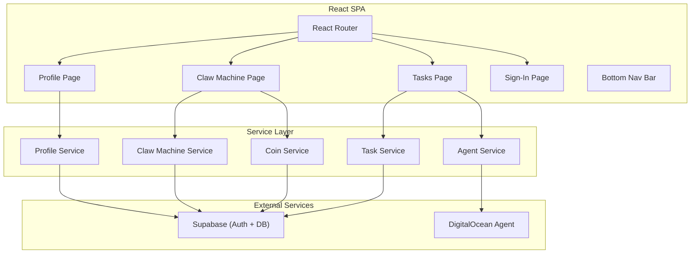
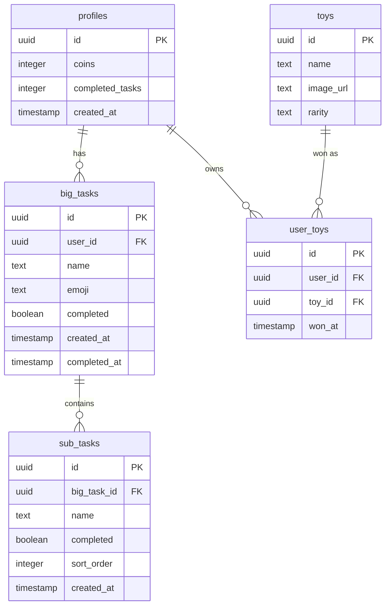

# Design Document: ADHD Task Breaker

## Overview

ADHD Task Breaker is a mobile-responsive React single-page application backed by Supabase. Users input a Big Task, which is sent to a DigitalOcean AI Agent that returns a list of Sub-Tasks and a single representative emoji. The emoji is displayed inside a circular progress bar that fills as Sub-Tasks are completed. Completing all Sub-Tasks awards 1 Coin. Coins are spent on a claw machine mini-game to win collectible Toys. A profile page shows completion stats and the Toy Collection.

The tech stack:
- **Frontend**: React + TypeScript, React Router, Tailwind CSS, Framer Motion, React Bits (animated UI components)
- **3D Landing Page**: Three.js (React Three Fiber) — lazy-loaded, only on sign-in page
- **Backend**: Supabase (Auth, PostgreSQL, Row Level Security)
- **AI**: DigitalOcean Agent (external API call)
- **Voice Input**: Web Speech API (browser-native, no external service)
- **Claw Machine**: Pre-built React component (already exists)
- **Testing**: Vitest + fast-check (property-based testing)

### Visual Theme: Cozy Pixel / Retro Arcade

The app follows a cozy pixel / retro arcade aesthetic to match the existing claw machine component:
- **Dark base**: Soft teal/navy backgrounds consistent with the claw machine
- **Neon accents**: Pink, cyan, and green for highlights and interactive elements
- **Typography**: Pixel-style font for headings and game elements, clean sans-serif (e.g., Inter) for task text to maintain readability
- **Containers**: Rounded cards with subtle glow effects
- **Tone**: Warm, kawaii, playful — matching the cute pixel toy characters

## Architecture



The app follows a simple layered architecture:
1. **Pages** — React components for each route, handle UI state and user interaction
2. **Services** — Plain TypeScript modules that encapsulate Supabase queries and external API calls
3. **Supabase** — Handles auth, database, and row-level security

No custom backend server is needed. The React app talks directly to Supabase and the DigitalOcean Agent endpoint.

## Components and Interfaces

### Pages

| Page | Route | Description |
|------|-------|-------------|
| `SignInPage` | `/sign-in` | Supabase auth UI with a lightweight Three.js animated background, redirects to `/tasks` on success |
| `TasksPage` | `/tasks` | Task input form + Active/Done tabs + task list with expandable Big Tasks |
| `ClawMachinePage` | `/claw-machine` | Claw machine game, coin balance display, play button |
| `ProfilePage` | `/profile` | Stats (completed tasks, coin balance) + Toy Collection gallery |

### Shared Components

| Component | Description |
|-----------|-------------|
| `BottomNavBar` | 3-tab navigation: Tasks, Claw Machine, Profile. Always visible on authenticated routes |
| `CircularProgressEmoji` | Emoji wrapped in an SVG circular progress bar. Accepts `emoji`, `progress` (0-1), `size` props |
| `TaskCard` | Expandable card showing Big Task name, emoji progress ring, and Sub-Task list |
| `SubTaskItem` | Single sub-task row with checkbox, editable name, delete button |
| `TaskInputForm` | Text input + mic button for voice input + submit button for creating new Big Tasks. Uses Web Speech API for voice transcription |
| `EmptyState` | Reusable encouraging empty-state message component |
| `ProtectedRoute` | Route wrapper that redirects unauthenticated users to `/sign-in` |

### Service Interfaces

```typescript
// Agent Service
interface AgentResponse {
  emoji: string;
  subTasks: string[];
}

async function breakDownTask(description: string): Promise<AgentResponse>;

// Task Service
async function createBigTask(userId: string, description: string, emoji: string, subTasks: string[]): Promise<BigTask>;
async function getBigTasks(userId: string, completed: boolean): Promise<BigTask[]>;
async function updateBigTaskName(taskId: string, name: string): Promise<void>;
async function deleteBigTask(taskId: string): Promise<void>;
async function toggleSubTask(subTaskId: string, completed: boolean): Promise<void>;
async function updateSubTaskName(subTaskId: string, name: string): Promise<void>;
async function deleteSubTask(subTaskId: string): Promise<void>;
async function addSubTask(bigTaskId: string, name: string): Promise<SubTask>;

// Coin Service
async function getCoinBalance(userId: string): Promise<number>;
async function spendCoin(userId: string): Promise<boolean>;
async function awardCoin(userId: string): Promise<void>;

// Profile Service
async function getProfile(userId: string): Promise<UserProfile>;
async function getToyCollection(userId: string): Promise<Toy[]>;

// Claw Machine Service
async function getAvailableToys(): Promise<Toy[]>;
async function awardToy(userId: string, toyId: string): Promise<void>;
```

## Data Models

### Supabase Database Schema



### TypeScript Types

```typescript
interface BigTask {
  id: string;
  userId: string;
  name: string;
  emoji: string;
  completed: boolean;
  createdAt: string;
  completedAt: string | null;
  subTasks: SubTask[];
}

interface SubTask {
  id: string;
  bigTaskId: string;
  name: string;
  completed: boolean;
  sortOrder: number;
}

interface UserProfile {
  id: string;
  coins: number;
  completedTasks: number;
}

interface Toy {
  id: string;
  name: string;
  imageUrl: string;
  rarity: string;
}

interface UserToy {
  id: string;
  toyId: string;
  toy: Toy;
  wonAt: string;
}
```

### Progress Calculation

The circular progress bar value is derived, not stored:

```typescript
function calculateProgress(subTasks: SubTask[]): number {
  if (subTasks.length === 0) return 0;
  const completed = subTasks.filter(st => st.completed).length;
  return completed / subTasks.length;
}
```

### Coin Award Logic

When a Sub-Task is toggled complete, the service checks if all sibling Sub-Tasks are now complete. If so, it marks the Big Task as complete and awards 1 Coin. This is done in a single Supabase RPC call (database function) to ensure atomicity.

```sql
-- Pseudocode for the RPC function
CREATE FUNCTION complete_subtask_and_check(p_subtask_id uuid, p_user_id uuid)
RETURNS void AS $$
  UPDATE sub_tasks SET completed = true WHERE id = p_subtask_id;
  
  -- Check if all siblings are complete
  IF (SELECT COUNT(*) FROM sub_tasks WHERE big_task_id = (SELECT big_task_id FROM sub_tasks WHERE id = p_subtask_id) AND completed = false) = 0 THEN
    UPDATE big_tasks SET completed = true, completed_at = now() WHERE id = (SELECT big_task_id FROM sub_tasks WHERE id = p_subtask_id);
    UPDATE profiles SET coins = coins + 1, completed_tasks = completed_tasks + 1 WHERE id = p_user_id;
  END IF;
$$;
```


## Correctness Properties

*A property is a characteristic or behavior that should hold true across all valid executions of a system — essentially, a formal statement about what the system should do. Properties serve as the bridge between human-readable specifications and machine-verifiable correctness guarantees.*

### Property 1: Whitespace-only task rejection

*For any* string composed entirely of whitespace characters (spaces, tabs, newlines, or empty string), submitting it as a Big Task description should be rejected, and no Big Task should be created.

**Validates: Requirements 1.3**

### Property 2: Big Task completion awards exactly 1 Coin

*For any* Big Task with N Sub-Tasks (N ≥ 1), when all N Sub-Tasks are marked as complete, the Big Task should be marked as complete and the user's coin balance should increase by exactly 1.

**Validates: Requirements 2.2**

### Property 3: Progress invariant

*For any* Big Task with a list of Sub-Tasks, after any mutation (adding a Sub-Task, deleting a Sub-Task, or toggling a Sub-Task's completion), the progress value should equal the number of completed Sub-Tasks divided by the total number of Sub-Tasks. When the Sub-Task list is empty, progress should be 0.

**Validates: Requirements 2.3, 8.4, 8.5**

### Property 4: Big Task deletion cascades to Sub-Tasks

*For any* Big Task with any number of associated Sub-Tasks, deleting the Big Task should result in zero Sub-Tasks remaining for that Big Task's ID.

**Validates: Requirements 8.3**

### Property 5: Coin deduction on Claw Machine play

*For any* user with a coin balance of N (N ≥ 1), initiating a Claw Machine game should result in a coin balance of exactly N − 1.

**Validates: Requirements 3.1**

### Property 6: Toy Collection grows on win

*For any* user and any Toy, when the Claw Machine game concludes with a win, the user's Toy Collection should contain the won Toy and the collection size should increase by 1.

**Validates: Requirements 3.3**

### Property 7: Protected route redirect

*For any* protected route in the application, when the user is not authenticated, navigating to that route should result in a redirect to the sign-in screen.

**Validates: Requirements 6.1**

### Property 8: Active tab filter correctness

*For any* set of Big Tasks belonging to a user, the Active tab should return only Big Tasks that have at least one incomplete Sub-Task, and the results should be sorted by creation date in descending order (newest first).

**Validates: Requirements 7.2**

### Property 9: Done tab filter correctness

*For any* set of Big Tasks belonging to a user, the Done tab should return only Big Tasks where all Sub-Tasks are marked complete, and the results should be sorted by completion date in descending order (newest first).

**Validates: Requirements 7.3**

## Error Handling

| Scenario | Handling Strategy |
|----------|-------------------|
| DigitalOcean Agent timeout (>10s) | Abort fetch, show friendly retry prompt with a "Try Again" button. No task is created. (Req 1.4) |
| DigitalOcean Agent returns malformed response | Validate response shape before processing. Show error message and retry prompt. |
| Supabase write failure | Optimistic UI update rolls back on failure. Show a subtle toast notification with "Something went wrong, please try again." |
| Supabase auth session expired | Detect 401 responses, clear local session, redirect to sign-in. (Req 6.1) |
| Coin spend with 0 balance | Prevent game start at the UI level (disable button) and validate server-side via RPC. (Req 3.2) |
| Empty/whitespace task submission | Client-side validation prevents submission. Input field shows inline validation message. (Req 1.3) |
| Network offline | Detect offline state, show a banner indicating no connection, disable mutation actions. |

## Testing Strategy

### Testing Framework

- **Unit & Integration Tests**: Vitest
- **Property-Based Testing**: fast-check (via `@fast-check/vitest` or direct `fast-check` import)
- **Component Tests**: Vitest + React Testing Library (for UI logic, not visual testing)

### Dual Testing Approach

Unit tests and property-based tests are complementary:
- **Unit tests** verify specific examples, edge cases, and integration points (e.g., "submitting 'Clean my room' creates a task with that name")
- **Property-based tests** verify universal properties that hold across all valid inputs (e.g., "for any whitespace string, submission is rejected")

Together they provide comprehensive coverage.

### Property-Based Testing Requirements

- Use `fast-check` as the PBT library
- Each property-based test runs a minimum of 100 iterations
- Each property-based test is tagged with a comment in this format: `**Feature: adhd-task-breaker, Property {number}: {property_text}**`
- Each correctness property from the design document is implemented by a single property-based test
- Generators should be crafted to produce realistic test data (valid emoji strings, reasonable task names, etc.)

### Test Organization

```
src/
  services/
    __tests__/
      taskService.test.ts        # Unit + property tests for task logic
      coinService.test.ts        # Unit + property tests for coin logic
      clawMachineService.test.ts # Unit + property tests for claw machine logic
  utils/
    __tests__/
      validation.test.ts         # Property tests for input validation
      progress.test.ts           # Property tests for progress calculation
      filters.test.ts            # Property tests for task filtering/sorting
  components/
    __tests__/
      ProtectedRoute.test.tsx    # Property test for route protection
```
