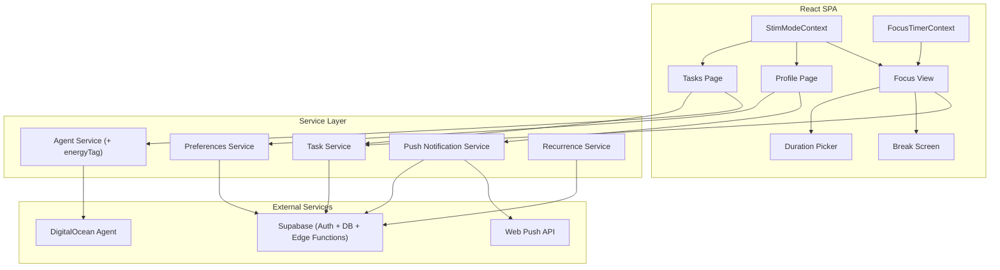

# Design Document: Post-Launch Improvements

## Overview

This design covers six post-launch features for Clear & Claw, ordered by implementation dependency. All features build on the existing React + TypeScript + Supabase + Tailwind stack. No new frameworks are introduced — the changes are additive to the existing architecture.

Key additions:
- **Database**: New columns on `big_tasks` and `profiles`, new `push_subscriptions` table, new `recurring_tasks` table
- **Agent Service**: Extended response format to include `energyTag`
- **React Context**: New `StimModeContext` for global Low Stimulation Mode state
- **Service Worker**: Extended for push notification handling
- **New utilities**: Focus timer logic, energy tag helpers, recurrence schedule logic

## Architecture



## Components and Interfaces

### New/Modified Components

| Component | Type | Description |
|-----------|------|-------------|
| `StimModeContext` | React Context | Global provider for Low Stimulation Mode state. Exposes `isLowStim`, `toggle()`, `setLowStim(boolean)`. Reads from Supabase on mount, respects `prefers-reduced-motion`. |
| `FocusTimerContext` | React Context | Manages timer state: `remainingSeconds`, `isRunning`, `isPaused`, `isPomodoro`, `pomodoroCount`, `isBreak`. Exposes `start(duration, pomodoro?)`, `stop()`, `pause()`, `resume()`. Uses `Date.now()` wall-clock for background resilience. |
| `DurationPicker` | Modal | Preset buttons (2, 5, 10, 15, 25, 45, 60 min) + custom input (1-120). Shows Pomodoro toggle when 25 is selected. |
| `TimerDisplay` | Component | Circular countdown display overlaid on Focus View. Shows mm:ss, progress ring, stop button. |
| `BreakScreen` | Component | Calming full-screen overlay during Pomodoro breaks. Shows break timer, "Skip break" button. Uses Low Stim palette. |
| `EnergyTagPicker` | Component | Inline 3-option selector (⚡🌤🌙). Used in task cards and task creation. |
| `EnergyFilter` | Component | Horizontal filter bar on Active tab with energy tag buttons + "All" option. |
| `RecurrenceConfig` | Component | Toggle + schedule picker (daily/weekdays/weekly/custom). Shown during task creation and in task edit. |
| `StreakBadge` | Component | Small badge showing 🔥 + streak count next to recurring task names. |
| `PushNotifToggle` | Component | Toggle switch on Profile page for enabling/disabling push notifications. Handles permission request flow. |
| `ReminderSchedulePicker` | Component | Dropdown for notification frequency (hourly, 2h, 3x/day, daily). |

### Modified Existing Components

| Component | Changes |
|-----------|---------|
| `TaskCard` | Add "Start Timer" button, Energy Tag display + picker, recurring icon + streak badge, coin reward preview shows 1/2/3 based on energy |
| `SubTaskItem` | No changes needed for this update |
| `TaskInputForm` | Add Energy Tag selector (pre-filled from agent), "Make recurring" toggle + RecurrenceConfig |
| `FocusView` (in TasksPage) | Integrate FocusTimerContext, highlight current sub-task, dim other elements when timer active |
| `ProfilePage` | Add Low Stim Mode toggle, Push Notification toggle + schedule picker |
| `BottomNavBar` | Respect Low Stim Mode colors |
| All animated backgrounds | Conditionally render based on `StimModeContext.isLowStim` |

### Service Interfaces

```typescript
// Extended Agent Response
interface AgentResponse {
  emoji: string
  subTasks: { name: string; emoji: string }[]
  energyTag: 'high' | 'medium' | 'low'  // NEW
}

// Energy Tag helpers
type EnergyTag = 'high' | 'medium' | 'low'

function energyTagToEmoji(tag: EnergyTag): string  // ⚡, 🌤, 🌙
function energyTagToCoins(tag: EnergyTag): number   // 3, 2, 1
function parseEnergyTag(value: string | null): EnergyTag  // defaults to 'medium'

// Preferences Service
interface UserPreferences {
  lowStimMode: boolean
  pushEnabled: boolean
  pushFrequency: 'hourly' | '2hours' | '3daily' | 'daily' | null
  lastSessionDate: string | null
}

async function getPreferences(userId: string): Promise<UserPreferences>
async function updatePreference(userId: string, key: string, value: unknown): Promise<void>

// Push Notification Service
async function subscribePush(userId: string, subscription: PushSubscription): Promise<void>
async function unsubscribePush(userId: string): Promise<void>
function isPushSupported(): boolean

// Recurrence Service
interface RecurrenceConfig {
  type: 'daily' | 'weekdays' | 'weekly' | 'custom'
  customDays?: number[]  // 0=Sun, 1=Mon, ..., 6=Sat
  reminderTime?: string  // HH:mm format
}

async function setRecurrence(taskId: string, config: RecurrenceConfig): Promise<void>
async function removeRecurrence(taskId: string): Promise<void>
async function getRecurringTasksDueToday(userId: string): Promise<BigTask[]>
async function resetRecurringTask(taskId: string): Promise<void>
async function incrementStreak(taskId: string): Promise<void>
async function resetStreak(taskId: string): Promise<void>

// Focus Timer (pure logic, no Supabase)
interface TimerState {
  durationMs: number
  startedAt: number       // Date.now() timestamp
  pausedAt: number | null
  isPomodoro: boolean
  pomodoroCount: number   // completed work intervals
  isBreak: boolean
}

function getRemainingMs(state: TimerState): number
function isTimerExpired(state: TimerState): boolean
function getBreakDuration(pomodoroCount: number): number  // 5 min or 15 min after 4
```

### Demo Task Creation

```typescript
// Called ONLY from ensureProfile (single trigger point to avoid race conditions)
async function createDemoTaskIfNeeded(userId: string): Promise<void> {
  const { count } = await supabase
    .from('big_tasks')
    .select('id', { count: 'exact', head: true })
    .eq('user_id', userId)

  if (count === 0) {
    await createBigTask(userId, '🎮 Build Your First Win', '🎮', [
      { name: 'Press Start', emoji: '▶️' },
      { name: 'Complete 1 action', emoji: '✅' },
      { name: 'Win your first coin', emoji: '🪙' },
      { name: 'Play claw machine', emoji: '🕹️' },
    ], 'low')  // low energy = 1 coin, easy first win
  }
}
```

## Data Models

### Database Schema Changes

```sql
-- Add energy_tag to big_tasks
ALTER TABLE big_tasks ADD COLUMN energy_tag text DEFAULT 'medium';

-- Add low_stim_mode and push preferences to profiles
ALTER TABLE profiles ADD COLUMN low_stim_mode boolean DEFAULT false;
ALTER TABLE profiles ADD COLUMN push_enabled boolean DEFAULT false;
ALTER TABLE profiles ADD COLUMN push_frequency text DEFAULT null;
ALTER TABLE profiles ADD COLUMN last_session_date timestamp with time zone DEFAULT null;

-- Recurring task configuration
CREATE TABLE recurring_tasks (
  id uuid PRIMARY KEY DEFAULT gen_random_uuid(),
  big_task_id uuid REFERENCES big_tasks(id) ON DELETE CASCADE UNIQUE,
  recurrence_type text NOT NULL,  -- 'daily', 'weekdays', 'weekly', 'custom'
  custom_days integer[] DEFAULT null,  -- [0,1,2,3,4,5,6]
  reminder_time time DEFAULT null,
  streak integer DEFAULT 0,
  last_completed_at timestamp with time zone DEFAULT null,
  last_reset_at timestamp with time zone DEFAULT null,
  created_at timestamp with time zone DEFAULT now()
);

-- Push notification subscriptions
CREATE TABLE push_subscriptions (
  id uuid PRIMARY KEY DEFAULT gen_random_uuid(),
  user_id uuid REFERENCES profiles(id) ON DELETE CASCADE,
  endpoint text NOT NULL,
  p256dh text NOT NULL,
  auth text NOT NULL,
  created_at timestamp with time zone DEFAULT now(),
  UNIQUE(user_id, endpoint)
);

-- RLS policies for new tables
ALTER TABLE recurring_tasks ENABLE ROW LEVEL SECURITY;
CREATE POLICY "Users manage own recurring tasks" ON recurring_tasks
  FOR ALL USING (
    big_task_id IN (SELECT id FROM big_tasks WHERE user_id = auth.uid())
  );

ALTER TABLE push_subscriptions ENABLE ROW LEVEL SECURITY;
CREATE POLICY "Users manage own push subscriptions" ON push_subscriptions
  FOR ALL USING (user_id = auth.uid());
```

### Updated `complete_subtask_and_check` RPC

The existing RPC awards 1 coin. It needs to be updated to read the `energy_tag` from the Big Task and award 1/2/3 coins accordingly:

```sql
CREATE OR REPLACE FUNCTION complete_subtask_and_check(p_subtask_id uuid, p_user_id uuid)
RETURNS void AS $$
DECLARE
  v_big_task_id uuid;
  v_energy_tag text;
  v_coins integer;
  v_incomplete_count integer;
  v_is_recurring boolean;
BEGIN
  -- Mark subtask complete
  UPDATE sub_tasks SET completed = true WHERE id = p_subtask_id
  RETURNING big_task_id INTO v_big_task_id;

  -- Count remaining incomplete subtasks
  SELECT COUNT(*) INTO v_incomplete_count
  FROM sub_tasks
  WHERE big_task_id = v_big_task_id AND completed = false;

  IF v_incomplete_count = 0 THEN
    -- Get energy tag
    SELECT COALESCE(energy_tag, 'medium') INTO v_energy_tag
    FROM big_tasks WHERE id = v_big_task_id;

    -- Calculate coins
    v_coins := CASE v_energy_tag
      WHEN 'high' THEN 3
      WHEN 'medium' THEN 2
      WHEN 'low' THEN 1
      ELSE 2
    END;

    -- Mark big task complete
    UPDATE big_tasks SET completed = true, completed_at = now()
    WHERE id = v_big_task_id;

    -- Award coins
    UPDATE profiles SET coins = coins + v_coins, completed_tasks = completed_tasks + 1
    WHERE id = p_user_id;

    -- Handle recurring task streak
    v_is_recurring := EXISTS (SELECT 1 FROM recurring_tasks WHERE big_task_id = v_big_task_id);
    IF v_is_recurring THEN
      UPDATE recurring_tasks
      SET streak = streak + 1, last_completed_at = now()
      WHERE big_task_id = v_big_task_id;
    END IF;
  END IF;
END;
$$ LANGUAGE plpgsql;
```

> **Note**: This RPC handles completion, coin award, and streak increment in one function. If logic grows more complex (e.g., streak bonuses, combo rewards), decompose into separate functions called within a transaction.

### Recurrence Reset Mechanism

Recurring task resets are triggered on app open, not via cron jobs. When the Tasks page loads:

1. Fetch all recurring tasks for the user where `last_reset_at` is before today's date (in user's timezone)
2. For each overdue task:
   - If the task was completed since last reset → streak was already incremented by the RPC
   - If the task was NOT completed since last reset → set streak to 0
   - Mark all sub-tasks as incomplete
   - Set `completed` to false on the Big Task
   - Update `last_reset_at` to now

```typescript
// Note: Uses client-side local date to determine "today" for timezone correctness.
// A user in UTC+9 should have tasks reset at their local midnight, not UTC midnight.
// The client passes its local date string to avoid timezone ambiguity.
//
// Performance note: This does N×3 sequential Supabase calls. For users with many
// recurring tasks, batch into a single RPC. Fine for v1 since recurring tasks are few.
async function checkAndResetRecurringTasks(userId: string): Promise<void> {
  const localToday = new Date().toLocaleDateString('en-CA') // YYYY-MM-DD in local tz
  const { data: overdue } = await supabase
    .from('recurring_tasks')
    .select('*, big_tasks!inner(*)')
    .eq('big_tasks.user_id', userId)
    .lt('last_reset_at', localToday)

  for (const rt of overdue ?? []) {
    const wasCompleted = rt.last_completed_at && rt.last_completed_at > rt.last_reset_at
    if (!wasCompleted) {
      await supabase.from('recurring_tasks').update({ streak: 0 }).eq('id', rt.id)
    }
    // Reset all sub-tasks to incomplete
    await supabase.from('sub_tasks').update({ completed: false })
      .eq('big_task_id', rt.big_task_id)
    // Reset big task completion
    await supabase.from('big_tasks').update({ completed: false, completed_at: null })
      .eq('id', rt.big_task_id)
    // Update last_reset_at
    await supabase.from('recurring_tasks').update({ last_reset_at: new Date().toISOString() })
      .eq('id', rt.id)
  }
}
```

### Updated TypeScript Types

```typescript
// Extended BigTask
interface BigTask {
  id: string
  userId: string
  name: string
  emoji: string
  completed: boolean
  energyTag: EnergyTag        // NEW
  createdAt: string
  completedAt: string | null
  subTasks: SubTask[]
  recurrence?: RecurrenceInfo  // NEW (optional)
}

interface RecurrenceInfo {
  type: 'daily' | 'weekdays' | 'weekly' | 'custom'
  customDays?: number[]
  reminderTime?: string
  streak: number
  lastCompletedAt: string | null
  lastResetAt: string | null
}

type EnergyTag = 'high' | 'medium' | 'low'

interface UserPreferences {
  lowStimMode: boolean
  pushEnabled: boolean
  pushFrequency: 'hourly' | '2hours' | '3daily' | 'daily' | null
  lastSessionDate: string | null
}
```

### Focus Timer State (Client-Side Only)

The timer is purely client-side — no database persistence. It uses wall-clock timestamps for background resilience:

```typescript
interface TimerState {
  durationMs: number
  startedAt: number        // Date.now()
  pausedAt: number | null  // Date.now() when paused
  isPomodoro: boolean
  pomodoroCount: number
  isBreak: boolean
}

// Remaining time accounts for background time
function getRemainingMs(state: TimerState): number {
  if (state.pausedAt) {
    return state.durationMs - (state.pausedAt - state.startedAt)
  }
  return Math.max(0, state.durationMs - (Date.now() - state.startedAt))
}
```

### Energy Tag Utilities

```typescript
const ENERGY_CONFIG = {
  high: { emoji: '⚡', coins: 3, label: 'High Energy' },
  medium: { emoji: '🌤', coins: 2, label: 'Medium Energy' },
  low: { emoji: '🌙', coins: 1, label: 'Low Energy' },
} as const

function energyTagToEmoji(tag: EnergyTag): string {
  return ENERGY_CONFIG[tag].emoji
}

function energyTagToCoins(tag: EnergyTag): number {
  return ENERGY_CONFIG[tag].coins
}

function parseEnergyTag(value: string | null | undefined): EnergyTag {
  if (value === 'high' || value === 'medium' || value === 'low') return value
  return 'medium'
}
```

### Low Stimulation Mode CSS Strategy

Low Stim Mode works by swapping CSS custom properties at the `:root` level:

```css
/* Normal mode (default) */
:root {
  --color-neon-cyan: #00e5ff;
  --color-neon-pink: #ff1493;
  --color-neon-yellow: #ffd700;
  --color-neon-green: #39ff14;
  --color-base-900: #0a0f1a;
  --color-base-800: #111827;
  --transition-duration: 1;  /* multiplier */
}

/* Low stim mode */
:root.low-stim {
  --color-neon-cyan: #7ec8c8;
  --color-neon-pink: #c4a0b0;
  --color-neon-yellow: #c8b87a;
  --color-neon-green: #8ab88a;
  --color-base-900: #1a1a2e;
  --color-base-800: #222240;
  --transition-duration: 0;  /* disables transitions */
}
```

The `StimModeContext` toggles the `low-stim` class on `document.documentElement`. Animated background components check `isLowStim` and render nothing (replaced by the solid `base-900` background).


## Correctness Properties

*A property is a characteristic or behavior that should hold true across all valid executions of a system — essentially, a formal statement about what the system should do. Properties serve as the bridge between human-readable specifications and machine-verifiable correctness guarantees.*

### Property 1: Energy Tag mapping consistency

*For any* valid Energy Tag value ("high", "medium", or "low"), the `energyTagToEmoji` function should return the corresponding emoji (⚡, 🌤, 🌙) and the `energyTagToCoins` function should return the corresponding coin value (3, 2, 1). Additionally, `parseEnergyTag` should return "medium" for any null, undefined, or invalid input.

**Validates: Requirements 1.2, 1.4, 1.7, 1.8, 1.9, 1.10**

### Property 2: Energy Tag filter correctness

*For any* set of Big Tasks with various Energy Tags and any selected Energy Tag filter value, the filtered results should contain only Big Tasks whose Energy Tag matches the selected filter. When "all" is selected, all tasks should be returned.

**Validates: Requirements 1.5**

### Property 3: Low Stimulation Mode round-trip

*For any* initial Low Stimulation Mode state (enabled or disabled), toggling the mode and then toggling it back should restore the original state. Specifically, `toggle()` followed by `toggle()` should return `isLowStim` to its original value.

**Validates: Requirements 2.4**

### Property 4: Timer remaining time correctness

*For any* timer with a given duration and start time, `getRemainingMs` should return a value equal to `durationMs - elapsed`, clamped to a minimum of 0. When the timer is paused, `getRemainingMs` should return the remaining time at the moment of pause regardless of how much wall-clock time has passed since.

**Validates: Requirements 4.3, 4.13, 4.14**

### Property 5: Timer restart preserves duration

*For any* timer that has expired, restarting the timer should produce a new timer state with the same `durationMs` as the original, a fresh `startedAt` timestamp, and `pausedAt` set to null.

**Validates: Requirements 4.6**

### Property 6: Pomodoro break duration

*For any* Pomodoro session with a completed work interval count N, the break duration should be 5 minutes when N is not a multiple of 4, and 15 minutes when N is a multiple of 4 (and N > 0).

**Validates: Requirements 4.7, 4.8**

### Property 7: Next incomplete Sub-Task selection

*For any* list of Sub-Tasks where at least one is incomplete, the "next incomplete" function should return the first Sub-Task (by sort order) that is not marked as completed. When all Sub-Tasks are complete, the function should return null.

**Validates: Requirements 4.10**

### Property 8: Notification task selection

*For any* set of active Big Tasks with varying numbers of incomplete Sub-Tasks, the notification task selector should return the Big Task with the fewest remaining incomplete Sub-Tasks.

**Validates: Requirements 5.2**

### Property 9: Recurring task reset clears all Sub-Tasks

*For any* Recurring Task with N Sub-Tasks in any combination of completed/incomplete states, resetting the task should result in all N Sub-Tasks being marked as incomplete and the Big Task completion status set to false.

**Validates: Requirements 6.2**

### Property 10: Streak consistency

*For any* Recurring Task with a current streak count S, completing the task before the next reset should result in a streak of S + 1. Failing to complete before reset should result in a streak of 0.

**Validates: Requirements 6.3, 6.4**

### Property 11: Recurrence schedule "due today" correctness

*For any* Recurrence Schedule and any day of the week, the "is due today" function should return true if and only if the current day matches the schedule: always true for "daily", true for Mon-Fri for "weekdays", true for the matching weekday for "weekly", and true if the day is in the `customDays` array for "custom".

**Validates: Requirements 6.6**

### Property 12: Remove recurrence preserves Sub-Task states

*For any* Recurring Task with Sub-Tasks in any combination of completed/incomplete states, removing the recurrence setting should preserve all Sub-Task completion states and convert the task to a standard one-time Big Task (no recurrence config, no streak).

**Validates: Requirements 6.8**

## Error Handling

| Scenario | Handling Strategy |
|----------|-------------------|
| Agent response missing `energyTag` field | `parseEnergyTag` defaults to "medium" (Req 1.4) |
| Legacy tasks with null `energy_tag` in DB | `parseEnergyTag` returns "medium", coin award uses 2 coins (Req 1.7) |
| Low Stim Mode toggle fails to persist | Optimistic UI update, show subtle toast on failure, retry on next toggle |
| Focus Timer drift from `setTimeout` inaccuracy | Use `Date.now()` wall-clock comparison instead of accumulated intervals |
| App killed during active timer | Timer state is lost (acceptable for v1). No penalty. |
| Push notification permission denied | Show explanation message, hide toggle, rely on in-app engagement (Req 5.5) |
| Push subscription fails to register | Show error toast, allow retry. Don't block other features. |
| Stale push subscription (browser revoked, device replaced) | When Edge Function receives a 410 (Gone) response from push endpoint, delete the subscription from `push_subscriptions` table automatically |
| Recurring task reset fails (Supabase error) | Retry on next app open. Show stale data with "sync pending" indicator. |
| Recurring task reset trigger | On app open (Tasks page load), check all recurring tasks for overdue resets. Call `resetRecurringTask` RPC for each. No cron job needed for v1. |
| Recurring task reminder time in past for today | Skip today's reminder, schedule for next occurrence |
| Custom duration input outside 1-120 range | Clamp to nearest valid value (1 or 120) |
| Pomodoro break skipped repeatedly | No penalty. User controls their workflow. |

## Testing Strategy

### Testing Framework

- **Unit & Integration Tests**: Vitest
- **Property-Based Testing**: fast-check (already installed)
- **Component Tests**: Vitest + React Testing Library (for context/hook logic)

### Dual Testing Approach

Unit tests and property-based tests are complementary:
- **Unit tests** verify specific examples and edge cases (e.g., "parseEnergyTag(null) returns 'medium'", "demo task has exactly 4 sub-tasks")
- **Property-based tests** verify universal properties across all valid inputs (e.g., "for any energy tag, coins are 1, 2, or 3")

### Property-Based Testing Requirements

- Use `fast-check` as the PBT library
- Each property-based test runs a minimum of 100 iterations
- Each property-based test is tagged with a comment: `**Feature: post-launch-improvements, Property {number}: {property_text}**`
- Each correctness property from the design document is implemented by a single property-based test
- Generators should produce realistic test data (valid energy tags, timer durations within range, sub-task lists of varying sizes)

### Test Organization

```
src/
  utils/
    __tests__/
      energyTag.test.ts          # Property tests 1, 2 (energy tag mapping + filtering)
      focusTimer.test.ts         # Property tests 4, 5, 6, 7 (timer logic + pomodoro)
      recurrence.test.ts         # Property tests 9, 10, 11, 12 (recurring task logic)
      notificationSelector.test.ts  # Property test 8 (notification task selection)
  contexts/
    __tests__/
      StimModeContext.test.tsx    # Property test 3 (low stim round-trip)
```
