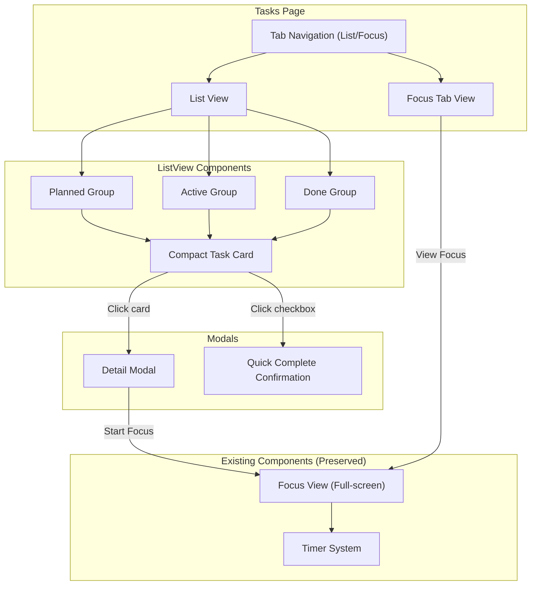

# Design Document: Task UI Refactor

## Overview

This design refactors the task management interface to provide a cleaner, more efficient UX for ADHD users. The key changes are: (1) replacing large task cards with compact single-line cards similar to subtask items, (2) introducing a Detail Modal for task editing instead of inline expansion, (3) adding List/Focus tab navigation, (4) implementing intelligent task grouping (Planned/Active/Done), and (5) hiding the energy tag system from users while maintaining coin rewards.

The refactor preserves all existing functionality (Focus View, timer, subtask management) while improving information density and reducing visual overwhelm.

## Architecture



## Components and Interfaces

### New Components

| Component | Type | Description |
|-----------|------|-------------|
| `CompactTaskCard` | Component | Single-line task card showing emoji, name, progress (X/Y), coins, and checkbox. Same size as SubTaskItem. |
| `TaskDetailModal` | Modal | Overlay modal for editing task name, emoji, viewing subtasks (read-only), and accessing Delete/Start Focus actions. |
| `QuickCompleteModal` | Modal | Confirmation dialog for quick-completing a task via checkbox. |
| `TaskGroupSection` | Component | Section header + list for Planned/Active/Done groups. |
| `FocusTabView` | Component | Dedicated tab showing only the task with active timer. |

### Modified Components

| Component | Changes |
|-----------|---------|
| `TasksPage` | Replace Active/Done tabs with List/Focus tabs. Add task grouping logic. Remove large task cards. |
| `TaskCard` | Delete (replaced by CompactTaskCard) |
| `FocusView` | No changes (preserved as-is) |

### Component Interfaces

```typescript
// Compact Task Card
interface CompactTaskCardProps {
  task: BigTask
  onCardClick: (task: BigTask) => void
  onCheckboxClick: (task: BigTask) => void
}

// Task Detail Modal
interface TaskDetailModalProps {
  task: BigTask
  isOpen: boolean
  onClose: () => void
  onEditName: (taskId: string, name: string) => void
  onEditEmoji: (taskId: string, emoji: string) => void
  onDelete: (taskId: string) => void
  onStartFocus: (task: BigTask) => void
}

// Quick Complete Modal
interface QuickCompleteModalProps {
  task: BigTask
  isOpen: boolean
  onConfirm: (taskId: string) => void
  onCancel: () => void
}

// Task Group Section
interface TaskGroupSectionProps {
  title: string
  emoji: string
  tasks: BigTask[]
  onCardClick: (task: BigTask) => void
  onCheckboxClick: (task: BigTask) => void
}

// Focus Tab View
interface FocusTabViewProps {
  activeTimerTask: BigTask | null
  onViewFocus: (task: BigTask) => void
}
```

## Data Models

### Task Grouping Logic

```typescript
// Group tasks by completion status
function groupTasks(tasks: BigTask[]): {
  planned: BigTask[]
  active: BigTask[]
  done: BigTask[]
} {
  const planned: BigTask[] = []
  const active: BigTask[] = []
  const done: BigTask[] = []

  for (const task of tasks) {
    const completedCount = task.subTasks.filter(st => st.completed).length
    const totalCount = task.subTasks.length

    if (task.completed) {
      done.push(task)
    } else if (completedCount === 0) {
      planned.push(task)
    } else {
      active.push(task)
    }
  }

  return { planned, active, done }
}
```

### Quick Complete Logic

```typescript
// Complete all subtasks and award coins
async function quickCompleteTask(taskId: string, userId: string): Promise<void> {
  // Get task to determine coin reward
  const task = await taskService.getBigTaskById(taskId)
  const coinReward = energyTagToCoins(task.energyTag)

  // Mark all subtasks complete
  for (const subtask of task.subTasks) {
    if (!subtask.completed) {
      await taskService.toggleSubTask(subtask.id, true, userId)
    }
  }

  // The last subtask completion will trigger the RPC that:
  // - Marks big task complete
  // - Awards coins based on energy tag
  // - Updates profile stats
}
```

### Energy Tag Visibility

```typescript
// Energy tag is stored but never displayed
interface BigTask {
  id: string
  userId: string
  name: string
  emoji: string
  completed: boolean
  energyTag: EnergyTag  // Stored in DB, not shown in UI
  createdAt: string
  completedAt: string | null
  subTasks: SubTask[]
}

// UI only shows coin amount
function getCoinDisplay(task: BigTask): string {
  const coins = energyTagToCoins(task.energyTag)
  return `🪙+${coins}`
}

// No UI element to view or edit energy tag
// Energy tag is set once by agent at creation, never changed
```

## UI Layouts

### Compact Task Card Layout

```
┌────────────────────────────────────────────┐
│ 📝 Write blog post    [3/5]  🪙+3      □  │
└────────────────────────────────────────────┘
  ↑   ↑                 ↑      ↑         ↑
  │   │                 │      │         └─ Checkbox (quick complete)
  │   │                 │      └─────────── Coin reward
  │   │                 └────────────────── Progress indicator
  │   └──────────────────────────────────── Task name
  └──────────────────────────────────────── Emoji

Height: 60-80px (same as SubTaskItem)
Click card → Opens Detail Modal
Click checkbox → Shows Quick Complete confirmation
```

### Task Detail Modal Layout

```
┌─────────────────────────────────────────┐
│  Write blog post                    [×] │
│  📝                                     │
│                                         │
│  Reward: 🪙 +3                          │
│                                         │
│  Sub-tasks:                             │
│  ✓ Research topic                       │
│  ✓ Write outline                        │
│  ✓ Write draft                          │
│  ○ Edit and polish                      │
│  ○ Publish                              │
│                                         │
│  [Delete]           [Start Focus]       │
└─────────────────────────────────────────┘

- Task name: editable (click to edit)
- Emoji: editable (click to edit)
- Coin reward: read-only
- Sub-tasks: read-only list (no checkboxes)
- Completed subtasks: strikethrough styling
- Actions: Delete (left), Start Focus (right)
```

### List Tab Layout

```
┌─────────────────────────────────────────┐
│  [List]  Focus                          │
├─────────────────────────────────────────┤
│                                         │
│  📋 Planned                             │
│  ┌───────────────────────────────────┐ │
│  │ 📝 Write blog post  [0/5] 🪙+3 □ │ │
│  └───────────────────────────────────┘ │
│  ┌───────────────────────────────────┐ │
│  │ 📞 Call dentist     [0/1] 🪙+1 □ │ │
│  └───────────────────────────────────┘ │
│                                         │
│  ⚡ Active                              │
│  ┌───────────────────────────────────┐ │
│  │ 🏃 Morning routine  [2/4] 🪙+1 □ │ │
│  └───────────────────────────────────┘ │
│                                         │
│  ✅ Done                                │
│  ┌───────────────────────────────────┐ │
│  │ ✓ Yesterday's task  [3/3] 🪙+2   │ │
│  └───────────────────────────────────┘ │
│                                         │
└─────────────────────────────────────────┘
```

### Focus Tab Layout

```
┌─────────────────────────────────────────┐
│  List  [Focus]                          │
├─────────────────────────────────────────┤
│                                         │
│  ⏱️ Currently Focused                   │
│                                         │
│  ┌───────────────────────────────────┐ │
│  │ 🏃 Morning routine  [2/4] 🪙+1   │ │
│  │ Timer: 23:45 remaining            │ │
│  │                                   │ │
│  │ [View Focus]                      │ │
│  └───────────────────────────────────┘ │
│                                         │
└─────────────────────────────────────────┘

When no timer active:
┌─────────────────────────────────────────┐
│  List  [Focus]                          │
├─────────────────────────────────────────┤
│                                         │
│         🎯                              │
│                                         │
│  Start a timer on any task to focus     │
│                                         │
└─────────────────────────────────────────┘
```

## Correctness Properties

*A property is a characteristic or behavior that should hold true across all valid executions of a system — essentially, a formal statement about what the system should do. Properties serve as the bridge between human-readable specifications and machine-verifiable correctness guarantees.*

### Property 1: Task grouping correctness

*For any* set of Big Tasks, the grouping function should place each task in exactly one group: Planned if 0 subtasks are complete, Active if some but not all subtasks are complete, and Done if all subtasks are complete (or task.completed is true).

**Validates: Requirements 1.3, 1.4, 1.5, 1.6**

### Property 2: Quick complete equivalence

*For any* Big Task, quick-completing via the checkbox should result in the same final state (all subtasks complete, task complete, coins awarded) as completing each subtask individually.

**Validates: Requirements 2.2, 2.4**

### Property 3: Energy tag invisibility

*For any* task displayed in the UI (compact card, detail modal, or focus view), the energy tag value (high/medium/low) should never be rendered or exposed to the user, while the coin amount derived from it should always be visible.

**Validates: Requirements 6.1, 6.2, 6.4**

### Property 4: Focus tab task selection

*For any* application state, the Focus tab should display exactly one task if and only if a timer is active, and that task should be the same task associated with the active timer.

**Validates: Requirements 4.1, 4.2, 4.5, 4.6**

### Property 5: Modal state isolation

*For any* task, opening and closing the Detail Modal without making changes should leave the task state unchanged (name, emoji, subtask completion, etc.).

**Validates: Requirements 3.8**

## Error Handling

| Scenario | Handling Strategy |
|----------|-------------------|
| User clicks checkbox on already-completed task | Disable checkbox on Done tasks, show visual indicator (checkmark, no border) |
| User quick-completes task with 0 subtasks | Allow completion, award coins based on energy tag (edge case but valid) |
| Detail Modal opened for deleted task | Close modal automatically, show toast "Task no longer exists" |
| Focus tab shows task but timer stopped | Update Focus tab to empty state on timer stop event |
| User edits task name to empty string | Reject edit, revert to previous name, show validation message |
| Network error during quick complete | Show error toast, revert UI state, allow retry |
| User navigates away during Detail Modal edit | Auto-save changes on modal close (no explicit save button) |

## Testing Strategy

### Testing Framework

- **Unit & Integration Tests**: Vitest
- **Property-Based Testing**: fast-check
- **Component Tests**: Vitest + React Testing Library

### Dual Testing Approach

Unit tests and property-based tests are complementary:
- **Unit tests** verify specific examples (e.g., "task with 0/5 subtasks goes to Planned group")
- **Property-based tests** verify universal properties (e.g., "every task appears in exactly one group")

### Property-Based Testing Requirements

- Use `fast-check` as the PBT library
- Each property-based test runs a minimum of 100 iterations
- Each property-based test is tagged with: `**Feature: task-ui-refactor, Property {number}: {property_text}**`
- Each correctness property is implemented by a single property-based test

### Test Organization

```
src/
  utils/
    __tests__/
      taskGrouping.test.ts       # Property test 1 (grouping correctness)
      quickComplete.test.ts      # Property test 2 (quick complete equivalence)
  components/
    __tests__/
      CompactTaskCard.test.tsx   # Unit tests for card rendering
      TaskDetailModal.test.tsx   # Unit tests for modal behavior, Property test 5
      FocusTabView.test.tsx      # Property test 4 (focus tab selection)
  pages/
    __tests__/
      TasksPage.test.tsx         # Integration tests, Property test 3 (energy tag invisibility)
```

### Key Test Cases

**Unit Tests:**
- Compact card renders all elements correctly
- Checkbox click triggers confirmation modal
- Card click opens detail modal
- Detail modal saves edits on blur/enter
- Focus tab shows empty state when no timer
- Task groups render with correct headers

**Property Tests:**
- Property 1: All tasks grouped correctly
- Property 2: Quick complete = individual complete
- Property 3: Energy tag never visible
- Property 4: Focus tab shows correct task
- Property 5: Modal doesn't mutate on cancel

## Migration Strategy

### Backward Compatibility

- All existing data structures remain unchanged
- Energy tag column already exists in database
- No data migration needed
- Existing Focus View preserved completely

### Rollout Plan

1. **Phase 1**: Implement new components alongside old ones
2. **Phase 2**: Switch TasksPage to use new components
3. **Phase 3**: Remove old TaskCard component
4. **Phase 4**: Test with existing user data

### Feature Flags

No feature flags needed - this is a complete UI replacement, not a gradual rollout.

## Performance Considerations

### Optimizations

- **Task grouping**: Memoize grouped tasks to avoid recalculation on every render
- **Compact cards**: Use React.memo to prevent unnecessary re-renders
- **Detail modal**: Lazy load, only render when open
- **Focus tab**: Subscribe to timer context, update only on timer state change

### Expected Impact

- **Reduced DOM nodes**: Compact cards have ~50% fewer elements than old cards
- **Faster initial render**: No expanded cards by default
- **Improved scroll performance**: Smaller cards = less layout thrashing
