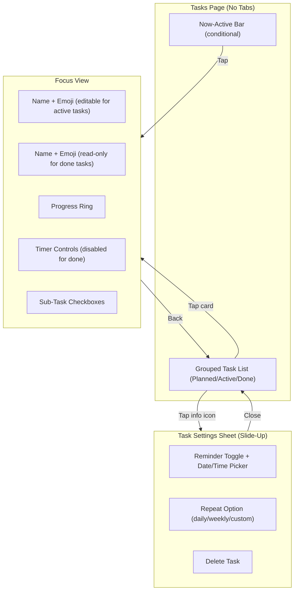

# Design Document: UX Flow Refinement

## Overview

This design refines the task management UX by: removing the List/Focus tab system, simplifying task cards (no checkbox), repurposing the Detail Sheet as a Task Settings panel (reminder, repeat, delete), making tap-on-card go directly to Focus View, rendering done tasks in read-only Focus View, adding a persistent now-active bar, and enforcing single-timer auto-swap.

The key separation: Focus View = work on the task (edit, timer, subtasks). Task Settings Sheet = configure the task (reminder, repeat, delete).

## Architecture



## Components and Interfaces

### Modified Components

| Component | Changes |
|-----------|---------|
| `TasksPage` | Remove tab navigation. Render grouped task list. Tap card → Focus View. Add Now-Active Bar. Remove quick complete flow. |
| `CompactTaskCard` | Remove checkbox. Show emoji, name, and settings (info) icon. Tap card area → Focus View. Tap info icon → Settings Sheet. |
| `TaskDetailModal` | Repurpose as Task Settings Sheet: reminder toggle, repeat option, delete. Remove name/emoji editing, subtask list, and Start Focus button. |
| `FocusView` (in TasksPage) | Keep editable name/emoji for non-completed tasks. For completed tasks: read-only name/emoji, disabled timer, disabled subtask checkboxes. |
| `FocusTimerContext` | No changes needed. |

### Removed Components/Flows

| Component/Flow | Reason |
|----------------|--------|
| `FocusTabView` | Already removed in task 1. |
| `QuickCompleteModal` | No checkbox on cards, completion only through Focus View subtasks. |

### New Components

| Component | Description |
|-----------|-------------|
| `NowActiveBar` | Persistent bar above bottom nav showing active timer task (emoji, name, time). Tap to open Focus View. |

### Component Interfaces

```typescript
// Now-Active Bar
interface NowActiveBarProps {
  task: BigTask
  remainingSeconds: number
  isPaused: boolean
  onClick: () => void
}

// Compact Task Card (updated)
interface CompactTaskCardProps {
  task: BigTask
  onCardClick: (task: BigTask) => void      // Tap card → Focus View
  onSettingsClick: (task: BigTask) => void   // Tap info icon → Settings Sheet
}

// Task Settings Sheet (repurposed from TaskDetailModal)
interface TaskSettingsSheetProps {
  task: BigTask | null
  isOpen: boolean
  onClose: () => void
  onDelete: (taskId: string) => void
  onSetReminder: (taskId: string, dateTime: Date | null) => void
  onSetRepeat: (taskId: string, repeat: RepeatOption | null) => void
}

type RepeatOption = 'daily' | 'weekly' | { custom: string }
```

## Data Models

### New Fields on BigTask

```typescript
// These fields will need to be added to BigTask
interface BigTask {
  // ... existing fields ...
  reminderAt: string | null      // ISO datetime for reminder
  repeatSchedule: string | null  // 'daily' | 'weekly' | custom cron-like string
}
```

### Auto-Swap Logic

```typescript
const handleStartFocus = (task: BigTask) => {
  if (timer.isRunning || timer.isPaused) {
    timer.stop()
    // Show toast: "Switched focus to [task.name]"
  }
  setFocusedTask(task)
}
```

### Now-Active Bar Visibility

```typescript
const showNowActiveBar = timer.isRunning || timer.isPaused
```

## UI Layouts

### Tasks Page

```
┌─────────────────────────────────────────┐
│  [Task Input Form]                      │
├─────────────────────────────────────────┤
│                                         │
│  📋 Planned                             │
│  ┌───────────────────────────────────┐  │
│  │ 📝 Write blog post           ⓘ   │  │  ← tap card → Focus, tap ⓘ → Settings
│  └───────────────────────────────────┘  │
│                                         │
│  ⚡ Active                              │
│  ┌───────────────────────────────────┐  │
│  │ 🏃 Morning routine           ⓘ   │  │
│  └───────────────────────────────────┘  │
│                                         │
│  ✅ Done                                │
│  ┌───────────────────────────────────┐  │
│  │ ✓ Yesterday's task            ⓘ   │  │  ← tap → read-only Focus View
│  └───────────────────────────────────┘  │
│                                         │
├─────────────────────────────────────────┤
│ 🏃 Morning routine    23:45  ▶         │  ← Now-Active Bar
├─────────────────────────────────────────┤
│  🎯 Tasks    🐻 Claw    👾 Profile     │  ← Bottom Nav
└─────────────────────────────────────────┘
```

### Task Settings Sheet (Slide-Up)

```
┌─────────────────────────────────────────┐
│  Task Settings                      ×   │
│                                         │
│  📝 Write blog post                    │  ← Task name (read-only label)
│                                         │
│  ─────────────────────────────────────  │
│                                         │
│  🔔 Reminder                    [OFF]   │  ← Toggle
│     When enabled: date/time picker      │
│                                         │
│  🔁 Repeat                     [None]   │  ← Dropdown: None/Daily/Weekly/Custom
│                                         │
│  ─────────────────────────────────────  │
│                                         │
│  [🗑 Delete Task]                       │  ← Destructive action
│                                         │
└─────────────────────────────────────────┘

Animation: translateY(100%) → translateY(0), ~300ms ease-out
```

### Focus View (Active Task — Editable)

```
┌─────────────────────────────────────────┐
│  ←                                      │
│                                         │
│         Write blog post                 │  ← Editable name (tap to edit)
│         3/5 done                        │
│                                         │
│         ┌─────────────┐                 │
│         │     📝      │                 │  ← Editable emoji + progress ring
│         │  (progress) │                 │
│         └─────────────┘                 │
│                                         │
│         23:45                           │
│         ⏸    ↻                          │  ← Timer controls
│                                         │
│    ☑ Research topic                     │
│    ☑ Write outline                      │
│    ☐ Edit and polish                    │  ← Subtask checkboxes
│    ☐ Publish                            │
│                                         │
└─────────────────────────────────────────┘
```

### Focus View (Done Task — Read-Only)

```
┌─────────────────────────────────────────┐
│  ←                                      │
│                                         │
│         Write blog post                 │  ← Read-only name
│         5/5 done                        │
│                                         │
│         ┌─────────────┐                 │
│         │     📝      │                 │  ← Read-only emoji + full progress ring
│         │  (complete) │                 │
│         └─────────────┘                 │
│                                         │
│         (no timer controls)             │
│                                         │
│    ☑ Research topic                     │
│    ☑ Write outline                      │
│    ☑ Write draft                        │  ← All checked, non-interactive
│    ☑ Edit and polish                    │
│    ☑ Publish                            │
│                                         │
└─────────────────────────────────────────┘
```

### Now-Active Bar

```
┌─────────────────────────────────────────┐
│  📝  Morning routine     23:45    ▶     │
└─────────────────────────────────────────┘

- Fixed position above bottom nav
- Shows: emoji, task name (truncated), remaining time, play/pause icon
- Tap anywhere → opens Focus View
- Not visible when no timer is active
```

## Correctness Properties

*A property is a characteristic or behavior that should hold true across all valid executions of a system — essentially, a formal statement about what the system should do. Properties serve as the bridge between human-readable specifications and machine-verifiable correctness guarantees.*

### Property 1: Now-Active Bar visibility is equivalent to timer active state

*For any* application state, the Now-Active Bar is rendered if and only if a timer is active (running or paused). When no timer is active, the bar is absent.

**Validates: Requirements 5.1, 5.4, 5.5**

### Property 2: Now-Active Bar displays correct task information

*For any* task with an active timer, the Now-Active Bar should display that task's emoji, that task's name, and the current remaining time from the timer.

**Validates: Requirements 5.2**

### Property 3: Auto-swap enforces single active timer

*For any* two distinct tasks, if a timer is running on the first task and the user starts a timer on the second task, then after the swap exactly one timer is active and it is associated with the second task.

**Validates: Requirements 6.1, 6.2**

### Property 4: Compact Task Card contains correct elements and no checkbox

*For any* task rendered as a Compact Task Card, the card should display the task emoji, task name, and a settings (info) icon, and should not contain a checkbox.

**Validates: Requirements 2.1, 2.2**

### Property 5: Task Settings Sheet contains required settings

*For any* task opened in the Task Settings Sheet, the sheet should contain a reminder toggle, a repeat option, and a delete task button.

**Validates: Requirements 3.3**

### Property 6: Focus View for non-completed task has editable fields and all elements

*For any* non-completed task opened in Focus View, the view should contain an editable task name, editable emoji, progress ring, sub-task list with checkboxes, and timer controls.

**Validates: Requirements 4.1, 4.3, 7.1**

### Property 7: Focus View for completed task is fully read-only with timer disabled

*For any* completed task opened in Focus View, the task name and emoji should be displayed as non-editable text, timer controls should be absent or disabled, and subtask checkboxes should be non-interactive.

**Validates: Requirements 4.2, 4.4**

## Error Handling

| Scenario | Handling Strategy |
|----------|-------------------|
| User opens settings for a deleted task | Close Settings Sheet, show toast "Task no longer exists", refresh task list |
| Timer expires while user is on task list | Remove Now-Active Bar, no interruption to current view |
| Auto-swap when previous timer was paused | Stop paused timer, start new timer, update Now-Active Bar |
| Network error during reminder/repeat save | Show error toast, revert toggle/option to previous value |
| User opens Focus View for task with no subtasks | Show empty subtask state, timer still functional |

## Testing Strategy

### Testing Framework

- **Unit & Integration Tests**: Vitest
- **Property-Based Testing**: fast-check
- **Component Tests**: Vitest + React Testing Library

### Dual Testing Approach

- **Unit tests** verify specific examples (e.g., "tapping Now-Active Bar opens Focus View")
- **Property-based tests** verify universal properties (e.g., "bar visible iff timer active")

### Property-Based Testing Requirements

- Use `fast-check` as the PBT library
- Each property-based test runs a minimum of 100 iterations
- Each property-based test is tagged with: `**Feature: ux-flow-refinement, Property {number}: {property_text}**`
- Each correctness property is implemented by a single property-based test

### Test Organization

```
src/
  components/
    __tests__/
      NowActiveBar.test.tsx          # Property tests 1, 2
      CompactTaskCard.test.tsx         # Property test 4
      TaskSettingsSheet.test.tsx       # Property test 5
      TaskDetailModal.test.tsx         # Legacy property test (modal state isolation)
  pages/
    __tests__/
      TasksPage.test.tsx              # Property test 3 (auto-swap)
      FocusView.test.tsx              # Property tests 6, 7
```
