# Design Document: AI Assistant (Chat + Voice)

## Overview

This feature adds a dual-mode AI assistant accessible via a dedicated "Assistant" navigation tab. The assistant is presented as **two distinct characters** with different personalities:

1. **Lea** 🌙 (Chat Mode): A calm, thoughtful assistant who prefers written communication. Uses Groq LLM for fast, cost-effective text responses.
2. **Law** ☀️ (Voice Mode): An energetic, upbeat assistant who loves talking. Uses Vapi for real-time voice conversation.

Both characters share the same task context and function-calling backend, but have distinct personalities and conversation styles. This design turns the technical limitation of separate chat/voice sessions into a feature - users can choose the assistant that matches their current mood or preference.

The character names follow the app's rhyme scheme: **Clear → Claw → Lea → Law**

## Architecture

```mermaid
flowchart TB
    subgraph Frontend["Frontend (React)"]
        AP[AssistantPage]
        APK[AssistantPicker]
        CV[ChatView<br/>Lea 🌙]
        VV[VoiceView<br/>Law ☀️]
    end
    
    subgraph Services["Assistant Services"]
        CS[ChatService<br/>Groq LLM]
        VS[VapiService<br/>Voice AI]
        FC[FunctionCaller]
    end
    
    subgraph Backend["Task Operations"]
        TS[taskService]
        AS[agentService]
        RS[recurrenceService]
        FT[FocusTimerContext]
    end
    
    subgraph External["External APIs"]
        GQ[Groq API]
        VA[Vapi API]
        SB[Supabase]
    end
    
    AP --> APK
    APK --> CV
    APK --> VV
    
    CV --> CS
    VV --> VS
    
    CS --> GQ
    CS --> FC
    VS --> VA
    VS --> FC
    
    FC --> TS
    FC --> AS
    FC --> RS
    FC --> FT
    
    TS --> SB
    AS --> GQ
```



## Character Definitions

### Lea 🌙 (Chat Assistant)
- **Personality**: Calm, collected, reassuring, thoughtful
- **Tone**: Soft, supportive, patient
- **Response style**: Short clear sentences, gentle confirmations, sparse emoji use
- **Example responses**: "Got it. ✓", "Nice progress.", "No worries, let's try another way."

### Law ☀️ (Voice Assistant)  
- **Personality**: Warm, enthusiastic, encouraging, energetic
- **Tone**: Upbeat, conversational, natural for speech
- **Response style**: Punchy phrases, enthusiastic confirmations, no emojis (voice)
- **Example responses**: "Done! You're crushing it!", "Let's go!", "No biggie!"

## Components and Interfaces

### 1. AssistantPage Component

The main page component that shows character picker first, then the selected assistant's interface.

```typescript
type AssistantMode = 'picker' | 'chat' | 'voice'

interface AssistantPageState {
  mode: AssistantMode
  messages: ChatMessage[]
  isLoading: boolean
  voiceState: 'idle' | 'connecting' | 'active' | 'error'
}
```

### 2. AssistantPicker Component

Character selection screen showing both Lea and Law side by side.

```typescript
interface AssistantPickerProps {
  onSelect: (mode: 'chat' | 'voice') => void
  voiceDisabled?: boolean
  voiceDisabledReason?: string
}
```

### 3. ChatMessage Interface

```typescript
interface ChatMessage {
  id: string
  role: 'user' | 'assistant'
  content: string
  timestamp: Date
  functionCalls?: FunctionCallResult[]
}

interface FunctionCallResult {
  name: string
  success: boolean
  result?: unknown
  error?: string
}
```

### 3. ChatService

Handles text-based chat interactions using Groq.

```typescript
interface ChatService {
  sendMessage(
    message: string,
    context: AssistantContext,
    onFunctionCall: (call: FunctionCall) => Promise<unknown>
  ): Promise<string>
}

interface AssistantContext {
  userId: string
  tasks: BigTask[]  // Limited to 20 most recent active tasks
  timerState: TimerState | null
  lastReferencedTaskId: string | null  // For pronoun resolution
  conversationHistory: ChatMessage[]   // Last N messages for context
}

interface FunctionCall {
  name: string
  arguments: Record<string, unknown>
}
```

### 4. VapiService

Manages voice session lifecycle with Vapi.

```typescript
interface VapiService {
  startSession(context: AssistantContext): Promise<void>
  endSession(): void
  onTranscript: (callback: (text: string) => void) => void
  onResponse: (callback: (text: string) => void) => void
  onFunctionCall: (callback: (call: FunctionCall) => Promise<unknown>) => void
  onError: (callback: (error: Error) => void) => void
  onStateChange: (callback: (state: VoiceState) => void) => void
}

type VoiceState = 'idle' | 'connecting' | 'active' | 'error'
```

### 5. FunctionCaller

Executes assistant function calls against the task system.

```typescript
interface FunctionCaller {
  execute(call: FunctionCall, userId: string): Promise<FunctionResult>
}

interface FunctionResult {
  success: boolean
  data?: unknown
  error?: string
  message: string // Human-readable result for assistant to speak
}
```

### 6. Assistant Functions

Available functions the assistant can call:

```typescript
type AssistantFunction =
  | 'createTask'
  | 'completeTask'
  | 'completeSubtask'
  | 'renameTask'
  | 'renameSubtask'
  | 'addSubtask'
  | 'removeSubtask'
  | 'deleteTask'
  | 'clearCompletedTasks'
  | 'setReminder'
  | 'removeReminder'
  | 'setRecurrence'
  | 'startTimer'
  | 'pauseTimer'
  | 'resumeTimer'
  | 'stopTimer'
  | 'getTimerStatus'
  | 'listTasks'
  | 'getTaskDetails'
  | 'getNextSubtask'

// "What's next" logic for getNextSubtask:
// 1. If timer is active with a task, suggest next incomplete subtask from that task
// 2. Otherwise, find the task with the most progress (highest % complete) that isn't done
// 3. Return the first incomplete subtask (by sort_order) from that task
```

## Data Models

### Chat Session Storage

Chat history is stored in localStorage for session continuity (not synced across devices).

```typescript
interface StoredChatSession {
  userId: string
  messages: ChatMessage[]  // Limited to last 50 messages
  lastReferencedTaskId: string | null
  lastUpdated: Date
}

// localStorage key: `assistant_chat_${userId}`
```

### Conversation History for LLM Context

```typescript
// Full history stored locally: 50 messages
// LLM context window: last 10 messages only (to manage token costs)
const LLM_CONTEXT_MESSAGE_LIMIT = 10

function buildLLMContext(messages: ChatMessage[]): ChatMessage[] {
  return messages.slice(-LLM_CONTEXT_MESSAGE_LIMIT)
}
```

### Task Context Loading

Tasks are loaded into assistant context at session start and updated after each operation:

```typescript
async function loadTaskContext(userId: string): Promise<BigTask[]> {
  // Load only active (non-completed) tasks, limited to 20 most recently UPDATED
  // This ensures actively worked-on tasks are prioritized over old stale tasks
  const { data: tasks } = await supabase
    .from('big_tasks')
    .select('*, sub_tasks(*)')
    .eq('user_id', userId)
    .eq('completed', false)
    .order('updated_at', { ascending: false })  // Most recently updated first
    .limit(20)
  
  return tasks ?? []
}
```

### Pronoun Resolution

The assistant tracks the last referenced task for pronoun resolution:

```typescript
interface ConversationState {
  lastReferencedTaskId: string | null
  lastReferencedSubtaskId: string | null
}

// Updated after each operation that references a specific task/subtask
// Used to resolve "it", "that task", "the last one", etc.
```
```

### Function Definitions for LLM

```typescript
const assistantFunctions: FunctionDefinition[] = [
  {
    name: 'createTask',
    description: 'Create a new task with AI-generated subtasks. REQUIRES user confirmation first.',
    parameters: {
      type: 'object',
      properties: {
        description: { type: 'string', description: 'The task description' },
        confirmed: { type: 'boolean', description: 'Whether user has confirmed creation' }
      },
      required: ['description', 'confirmed']
    }
  },
  {
    name: 'completeTask',
    description: 'Mark a BigTask as completed (all subtasks must be done)',
    parameters: {
      type: 'object',
      properties: {
        taskName: { type: 'string', description: 'Name or partial name of the task' }
      },
      required: ['taskName']
    }
  },
  {
    name: 'completeSubtask',
    description: 'Mark a subtask as completed',
    parameters: {
      type: 'object',
      properties: {
        subtaskName: { type: 'string', description: 'Name or partial name of the subtask' }
      },
      required: ['subtaskName']
    }
  },
  {
    name: 'deleteTask',
    description: 'Delete a BigTask. REQUIRES user confirmation first.',
    parameters: {
      type: 'object',
      properties: {
        taskName: { type: 'string', description: 'Name of the task to delete' },
        confirmed: { type: 'boolean', description: 'Whether user has confirmed deletion' }
      },
      required: ['taskName', 'confirmed']
    }
  },
  {
    name: 'clearCompletedTasks',
    description: 'Delete all completed tasks. REQUIRES user confirmation first.',
    parameters: {
      type: 'object',
      properties: {
        confirmed: { type: 'boolean', description: 'Whether user has confirmed clearing' }
      },
      required: ['confirmed']
    }
  },
  // ... additional function definitions
]

// Note: agentService (existing DigitalOcean Agent) is called by createTask
// ONLY after confirmed: true to generate subtasks via AI breakdown
```

### Voice Confirmation Flow

For voice mode, confirmation works via verbal response:
- Assistant asks: "Should I create a task called 'Prep dinner party'?"
- User says: "yes", "do it", "confirm", "go ahead" → confirmed: true
- User says: "no", "cancel", "never mind" → confirmed: false
- Vapi's natural language understanding handles variations

```typescript
// Vapi system prompt includes:
// "For destructive actions (delete, clear) and task creation, 
//  always ask for verbal confirmation. Listen for 'yes', 'confirm', 
//  'do it', 'go ahead' as confirmation. 'No', 'cancel', 'never mind' 
//  means abort the action."
```

### Groq Model Configuration

```typescript
const GROQ_CONFIG = {
  model: 'llama-3.3-70b-versatile',  // Best function calling support
  temperature: 0.7,
  maxTokens: 1024,
}
```


## Correctness Properties

*A property is a characteristic or behavior that should hold true across all valid executions of a system-essentially, a formal statement about what the system should do. Properties serve as the bridge between human-readable specifications and machine-verifiable correctness guarantees.*

### Property 1: Task creation requires explicit confirmation

*For any* task creation request (via chat or voice), the Assistant SHALL NOT call the `createTask` function with `confirmed: true` unless the user has explicitly confirmed the action in a prior message.

**Validates: Requirements 4.1, 4.2, 4.7**

### Property 2: Completion operations mark the correct item

*For any* completion request with a task or subtask name, if exactly one item matches the name, that item's `completed` status SHALL be set to `true` after the operation.

**Validates: Requirements 5.1, 5.2, 5.4**

### Property 3: Edit operations modify the correct items

*For any* edit operation (rename task, rename subtask, add subtask, remove subtask) with valid parameters, the corresponding item SHALL be modified according to the operation type, and the response SHALL confirm the change.

**Validates: Requirements 6.1, 6.2, 6.3, 6.4, 6.5**

### Property 4: Destructive operations require confirmation

*For any* destructive operation (delete task, clear completed tasks), the operation SHALL NOT execute unless the user has explicitly confirmed the action. The response SHALL include the count of items affected.

**Validates: Requirements 7.1, 7.2, 7.3, 7.4**

### Property 5: Timer operations correctly transition state

*For any* timer operation:
- `startTimer` on idle timer → timer becomes running with specified duration
- `pauseTimer` on running timer → timer becomes paused with remaining time preserved
- `resumeTimer` on paused timer → timer becomes running
- `stopTimer` on any state → timer becomes idle

**Validates: Requirements 9.1, 9.2, 9.3, 9.4**

### Property 6: Query operations return accurate information

*For any* query operation (list tasks, get task details, get timer status, get next subtask), the response SHALL accurately reflect the current state of the task system and timer.

**Validates: Requirements 9.5, 10.1, 10.2, 10.3**

### Property 7: Disambiguation requested for ambiguous matches

*For any* operation that references a task or subtask by name, if multiple items match the provided name, the Assistant SHALL NOT execute the operation and SHALL instead ask for clarification.

**Validates: Requirements 5.3**

### Property 8: Function calls include required parameters

*For any* function call made by the Assistant, all required parameters as defined in the function schema SHALL be present and valid.

**Validates: Requirements 2.2**

### Property 9: Task context limited to 20 active tasks

*For any* assistant session, the task context SHALL contain at most 20 BigTasks, and all tasks in context SHALL have `completed: false`.

**Validates: Requirements 13.1, 13.2**

### Property 10: Pronoun resolution uses last referenced task

*For any* command containing a pronoun reference ("it", "that task", "the last one"), if `lastReferencedTaskId` is set, the operation SHALL target that task. If not set, the Assistant SHALL ask for clarification.

**Validates: Requirements 13.3, 13.4**

### Property 11: Context updates after task operations

*For any* task operation (create, complete, edit, delete), the assistant context SHALL be updated to reflect the change before the next user message is processed.

**Validates: Requirements 13.5**

### Property 12: Chat history limited to 50 messages

*For any* stored chat session, the message array SHALL contain at most 50 messages, with oldest messages removed when the limit is exceeded.

**Validates: Requirements 14.1, 14.2**

## Error Handling

### Voice Call Persistence

When a user navigates away during an active voice call:

```typescript
// VoiceCallProvider wraps the entire app (in App.tsx)
interface VoiceCallState {
  isActive: boolean
  sessionId: string | null
  vapiInstance: Vapi | null
}

// FloatingCallIndicator component shown when:
// - Voice call is active AND
// - User is NOT on AssistantPage
// 
// Visual hierarchy when both indicators present:
// - FloatingCallIndicator: positioned above Now-Active Bar (z-index higher)
// - Now-Active Bar: standard position at bottom
```

### Tier Gating for Voice

```typescript
interface TierGateProps {
  feature: 'voice'
  children: ReactNode
  fallback: ReactNode  // Upgrade prompt
}

// When free user taps call button:
// 1. Check user tier from profile
// 2. If free: show UpgradePrompt modal
// 3. If paid: proceed with Vapi session
```

### Chat Service Errors

| Error Type | Handling |
|------------|----------|
| Groq API timeout | Display "Taking longer than expected..." message, retry once |
| Groq API rate limit | Display "Please wait a moment" message, implement exponential backoff |
| Invalid function call | Log error, respond with "I couldn't do that, please try again" |
| Network error | Display offline indicator, queue message for retry |

### Voice Service Errors

| Error Type | Handling |
|------------|----------|
| Vapi connection failed | Display error toast, show retry button |
| Microphone permission denied | Display permission request UI with instructions |
| Session timeout | Auto-reconnect once, then show "Call ended" message |
| WebRTC not supported | Display "Voice not supported on this browser" message |

### Function Execution Errors

| Error Type | Handling |
|------------|----------|
| Task not found | Respond with "I couldn't find a task called [name]" |
| Multiple matches | Respond with "I found multiple items matching [name], which one?" |
| Database error | Respond with "Something went wrong, please try again" |
| Permission denied | Respond with "You don't have permission to do that" |

## Testing Strategy

### Rate Limiting & Cost Guardrails

```typescript
const RATE_LIMITS = {
  // Chat (Groq) - generous for free tier since cost is low
  chatMessagesPerDay: 100,        // Free tier
  chatMessagesPerDayPaid: 500,    // Paid tier
  
  // Voice (Vapi) - more restrictive due to higher cost
  voiceMinutesPerMonth: 60,       // Paid tier only (free tier has no voice)
  
  // Token budget per message to prevent runaway costs
  maxInputTokensPerMessage: 2000,
  maxOutputTokensPerMessage: 1024,
}

// Chat rate limits: localStorage (acceptable if bypassed, low cost)
// Voice rate limits: Supabase profiles table (prevents gaming, real cost)
interface RateLimitState {
  chatMessagesToday: number
  chatResetDate: string  // ISO date
}

// Voice minutes tracked in Supabase profiles table:
// voice_minutes_used: number
// voice_minutes_reset_month: string (YYYY-MM)
```

When limits are reached:
- Chat: Display "You've reached your daily message limit. Upgrade for more!" 
- Voice: Display "You've used your voice minutes for this month."

### Property-Based Testing Library

This project will use **fast-check** for property-based testing in TypeScript/JavaScript.

### Unit Tests

Unit tests will cover:
- ChatService message processing
- FunctionCaller execution for each function type
- VapiService session lifecycle
- Component rendering and state management

### Property-Based Tests

Each correctness property will be implemented as a property-based test:

1. **Task creation confirmation**: Generate random task descriptions, verify `confirmed` parameter is checked
2. **Completion operations**: Generate random task/subtask names, verify correct item is marked complete
3. **Edit operations**: Generate random edit parameters, verify correct modifications
4. **Destructive confirmation**: Generate random delete requests, verify confirmation is required
5. **Timer state machine**: Generate random sequences of timer operations, verify state transitions
6. **Query accuracy**: Generate random task states, verify query responses match state
7. **Disambiguation**: Generate scenarios with duplicate names, verify clarification is requested
8. **Function parameter validation**: Generate random function calls, verify required parameters

### Test Annotations

All property-based tests will be annotated with:
```typescript
// **Feature: vapi-voice-agent, Property {number}: {property_text}**
// **Validates: Requirements X.Y**
```

### Integration Tests

Integration tests will cover:
- End-to-end chat flow with mocked Groq API
- End-to-end voice flow with mocked Vapi
- Function calling with real taskService (test database)

